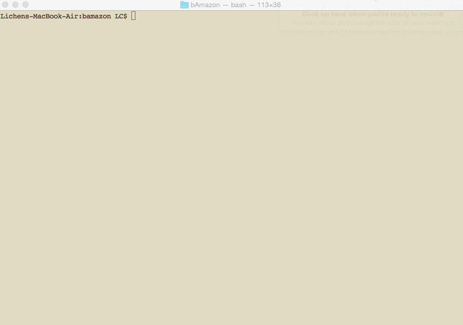
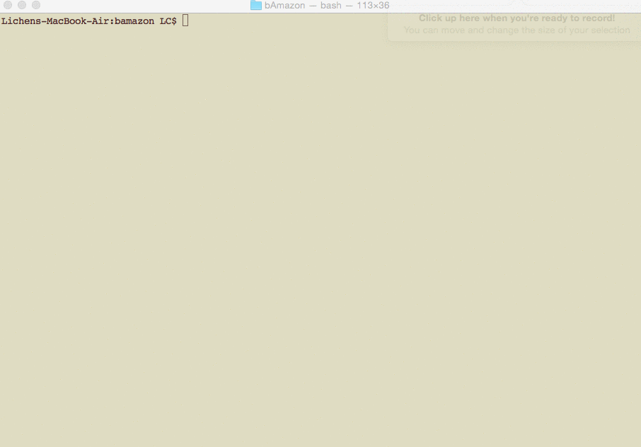
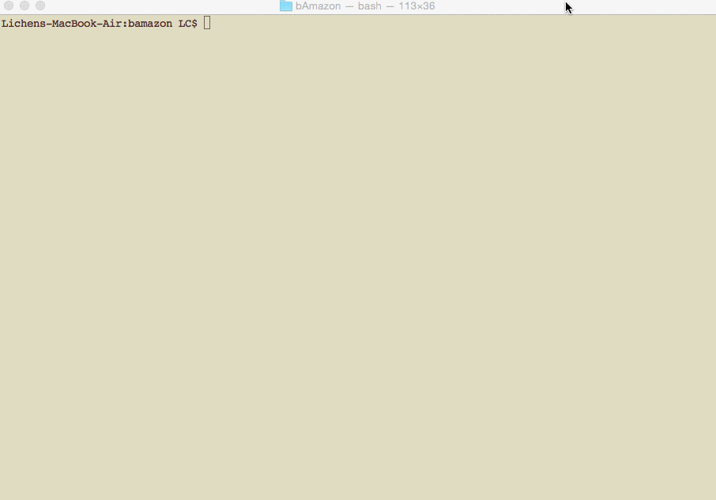

# bAmazon

##Overview
bAmazon is an Amazon-like storefront with MySQL, inquirer npm package and NodeJS.

### 1. Customer View
Customer can order products based on item ID.

Demo:

### 2. Manager View
Manager can do the followings after authorization:

1. View Products for Sale
2. View Low Inventory
3. Add to Inventory
4. Add New Product

Demo:

### 3. Supervisor View
Supervisor can do the followings after authorization:

1. View Product Sales by Department
2. View the calculated profit for each department
3. Create New Department

Demo:

